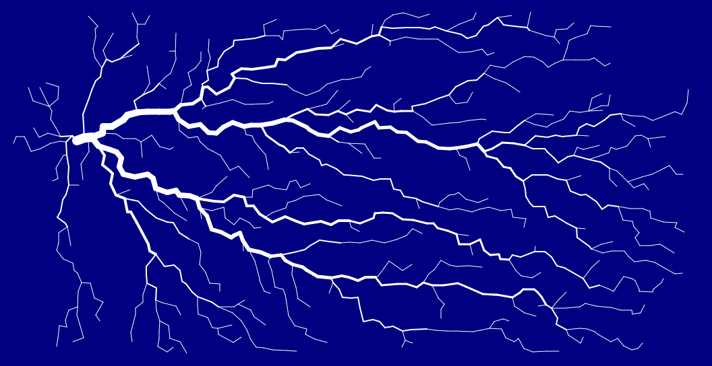

# CUDA Lichtenberg



## Overview 👁️
Remake of my student project for Database Lab course. Goal was to create some simple database with one or two tables, and fill these tables with some interesting data. My idea was to create Lichtenberg figures and store them in database, along with some informations about image size and colors. But in this version, I do not contain database features part.

### Lichtenberg figures
[__Lichtenberg figures__](http://www.capturedlightning.com/frames/lichtenbergs.html) are branching, tree-like patterns, created by the passage of high voltage electrical discharges along the surface, or inside, electrically insulating materials (dielectrics). Discovered by Georg Christoph Lichtenberg in 18th century.  
These figures are similar to thunder lightnings, tree roots or ... blood vessels. My supervisor in the university said, that this program could simulate eyes blood vessels, if only it could generate 'lightnings' in circular shapes.  
And of course, what is most interesting for mathematicians and computer scientists, Lichtenberg figures are graphs, trees to be more precise. 

## Project description 📋
This project constains two parts: 
### Lichtenberg figures library
Using __Nvidia CUDA__ and its library: __nvGraph__. Generating algorithm is based on [SSSP](https://developer.nvidia.com/discover/shortest-path-problem) (Single-Source Shortest Path) problem, which is solved using nvGraph library. Lightnings are stored as SVG format string and returned to user. This format was used to compress images and reduce their sizes. Because of specific image properties, this method is very effective. And of course, vector graphics is scalable, which is a very useful feature. 

#### Creating graph
Process of creating graph starts with creating vertices. The available space is divided into squares and each square will contain only one vertex, but some squares will remain without vertex (with small probability, but still). The __(x,y)__ coords are gerenating randomly using __cuRand__ library. 


Then edges are creating. It is important, that we need planar graph (or to be more precise, planar representation of graph). So we connect (if possible) vertex with the one above, under, from the left and right. Then crossing, but we need to know if we can create edge between _TL_ (top left), _TR_, _BL_ and _BR_ (bottom riht). Image on the right demonstrate this situation. We can use some function which as an argument use __x__ or __y__ coord value to determine if we can connect two vertices. From the left side we use _x-1_ (_y-1_) value, from the right side _x_ (_y_) value. This simple way allows to generate proper graph. After these steps, we use SSSP algorithm and draw result image. 

#### Drawing result image
Firstly we choose init vertex. Then we get a subset of available vertices and find which edges are required to 
connect two vertices. The more times each edge is required, the bolder line will be drawn in result.  

### Lichtenberg API 
Is a simple web api which allows end-user to generate and store sample images. Written in F# using ASP.NET framework.

## Tools 🛠️
Project can be compiled and run on Windows & Linux.
### Software for LightenbergGeneretor
1. [Visual Studio 2019](https://learn.microsoft.com/en-us/visualstudio/releases/2019/release-notes) (VS 2017 is also possible)
2. [CUDA API v10.2](https://developer.nvidia.com/cuda-10.2-download-archive) (latest version with included nvGraph library)
3. Maybe it will be necessary to include path to _lib_ folder with CUDA libraries in PATH variable.

### Software for LightenbergAPI
1. [Visual Studio Code](https://code.visualstudio.com/) or other IDE
2. [.NET 7 SDK](https://dotnet.microsoft.com/en-us/download/dotnet/7.0) or newer

## How to compile 💻
### LichtenbergGenerator
Project is prepare for building .dll file. Just open the `.sln` file in Visual Studio and build the project. Remember to set _Release_ version.  

## How to run ⚙️
### LichtenbergAPI
Open folder with `.fsproj` file in Visual Studio Code and open terminal. Then run `dotnet run -c Release`. API has only one endpoint which allows to generate Lichtenberg figures:  
__`GET /lichtenberg/{filename}`__  

Route required parameters:
 - `filename` -> string, output file name without extension

Query required parameters:
 - `sizex` -> integer, the image width in pixels
 - `sizey` -> integer, the image height in pixels
 - `cratesize` -> integer, determine how densely the vertices will be placed in the grid.
 - `start` -> integer, which verte will be the start point for SSSP algorithm.
 - `verticescount` -> integer, how many vertices will be use for creating 'lightning'
 - `lightcolor` -> string, color name for 'lightning'
 - `backcolor` -> string, color name for background  
 Both colors have to be valid [HTML color names](https://www.w3schools.com/colors/colors_names.asp). 

 Example: `http://localhost:5288/lichtenberg/example?lightcolor=blue&backcolor=white&sizex=512&sizey=512&cratesize=16&verticescount=100&start=200`  
 The decision to use query parameters was taken for the convenience of use, there is no need to create a query body. All you need is a web browser or program like `curl` or `wget`.

 To calculate valid values, please use this constraints & formulas:
  ```
  numberOfVertices = sizex * sizey / (cratesize^2)
  0 <= start < numberOfVertices
  0 <= verticescount < numberOfVertices
  sizex % cratesize = 0
  sizey % cratesize = 0
  ``` 
